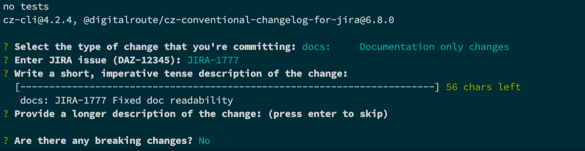

# Conventional Changelog

## What

In order to enable a Changelog generation during the merge process we need to install conventional changelog and commitizen. The main goal is to facilitate users the generation of valid changelog messages during the git commit stage.


## Environment

This repo was tested with the following setup

* Macbook pro with BiGSur os M1 and Intel x64
* nvm with nodejs v14.17.0 installed
* npm v6.14.13

If you have nvm installed there is an .nvmrc that will determine the version on node to use

Just type

```bash
nvm use
```

And nvm will install the correct node version.

## Setup

Init npm repo

```shell
npm init -y
````

Install dev dependencies

```shell
npm i -D @digitalroute/cz-conventional-changelog-for-jira @semantic-release/gitlab commitizen eslint prettier semantic-release semver
```

add the following to package.json

```json
{
  "scripts": {
    "commit": "git-cz"
  },
  "config": {
    "commitizen": {
      "path": "./node_modules/@digitalroute/cz-conventional-changelog-for-jira"
    }
  }
}
```

For additional customization head over to [cz-conventional-changelog-jira](https://github.com/digitalroute/cz-conventional-changelog-for-jira)

## Commitlint

If using the commitlint js library, the "maxHeaderWidth" configuration property will default to the configuration of the "header-max-length" rule instead of the hard coded value of 72. This can be overwritten by setting the 'maxHeaderWidth' configuration in package.json or the CZ_MAX_HEADER_WIDTH environment variable.

## Husky Setup

Optionally setup [husky](https://typicode.github.io/husky/#/) so git hooks get triggered when committing, your mileage may vary.

You might need to add prepare stanza for husky to work.

## Usage

npm run commit

---
**TIP**

You must do a 'git add .' otherwise it will not work

---


## Additional References

[Setting up semantic release in gitlab ci](https://semantic-release.gitbook.io/semantic-release/recipes/recipes/gitlab-ci)

[Husky issues](https://github.com/typicode/husky/issues/862)